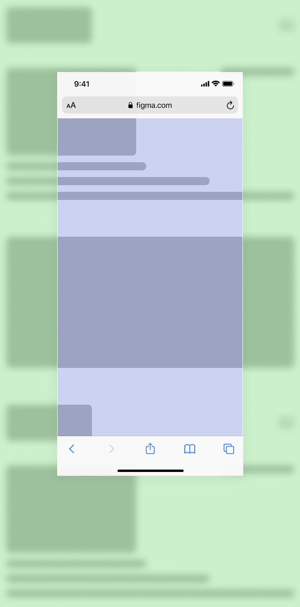
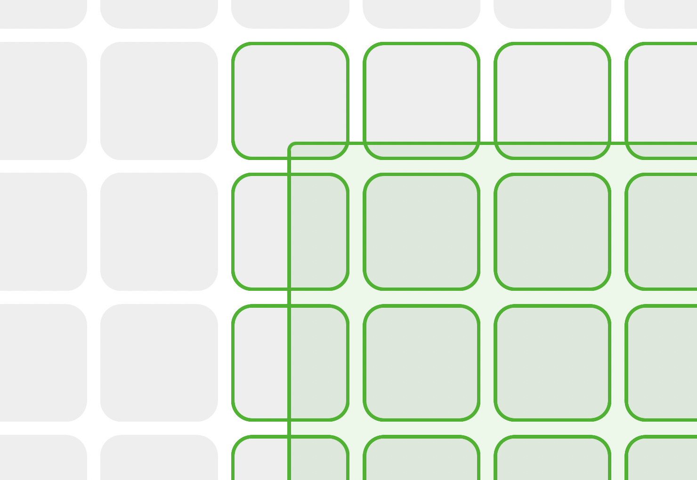
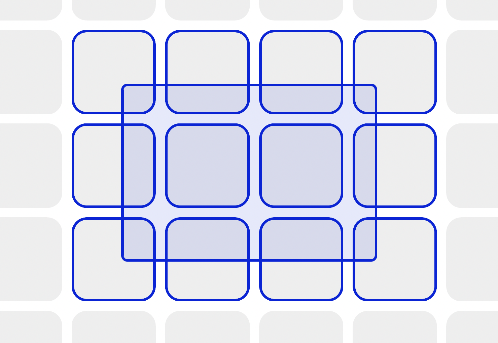
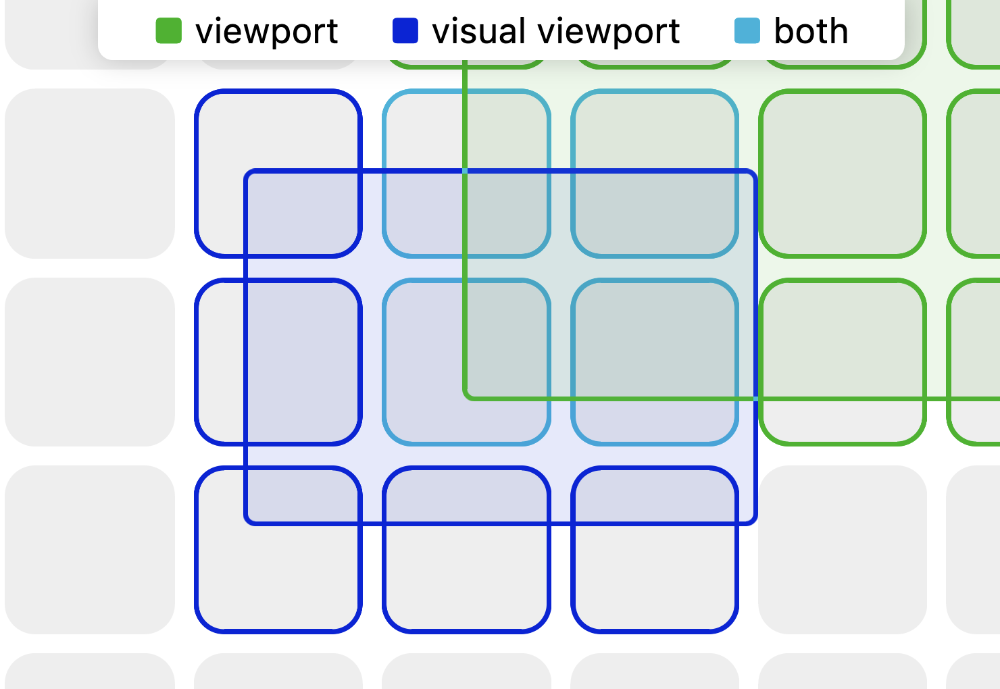

# Visual Intersection Observer

[](https://www.npmjs.com/package/@juo/visual-intersection-observer)



## Problem

There is a great [Intersection Observer API](https://developer.mozilla.org/en-US/docs/Web/API/Intersection_Observer_API) that allows (among others) to observe if website elements are present in the viewport or not. The missing part in that API is that one can never use [Visual Viewport](https://developer.mozilla.org/en-US/docs/Web/API/VisualViewport) as the root for the `IntersectionObserver`. At the time of writing, there is an open discussion regarding this issue [here](https://github.com/w3c/IntersectionObserver/issues/95).

So, in other words, `IntersectionObserver` works great as long as the user does not zoom the website in or out. As soon as this happens, the intersections reported by the `IntersectionObserver` are invalid.

## Solution

A `Visual Intersection Observer` that acts as a wrapping utility for the `Intersection Observer`, which modifies the `rootMargin` appropriately to the `Visual Viewport`.

Here's the [demo](https://juo.github.io/visual-intersection-observer/) to see it in action.


| Layout Viewport | Visual Viewport | Both |
| - | - | - |
|  |  |  |

## Getting started

### Installation

With a package manager:

```
npm install @juo/visual-intersection-observer
```

CDN:

```
<script src="https://unpkg.com/@juo/visual-intersection-observer"></script>
```

### Usage

`Visual Intersection Observer` works just like the [Intersection Observer](https://developer.mozilla.org/en-US/docs/Web/API/IntersectionObserver) with one caveat: you can't specify `root` option.

```
# ESM
import { VisualIntersectionObserver } from '@juo/visual-intersection-observer';

# UMD
const { VisualIntersectionObserver } = window['visual-intersection-observer'];

// Create an observer that logs entries to the console
const ob = new VisualIntersectionObserver((entries) => {
  console.log(entries);
});

// Observe an element
ob.observe(document.getElementById('foo'));
```

## Known issues

- When the document width is larger than the viewport, the intersection is not computed properly on mobile devices.
- Chrome and Firefox on mobile sometimes report an incorrect width/height of the Visual Viewport
